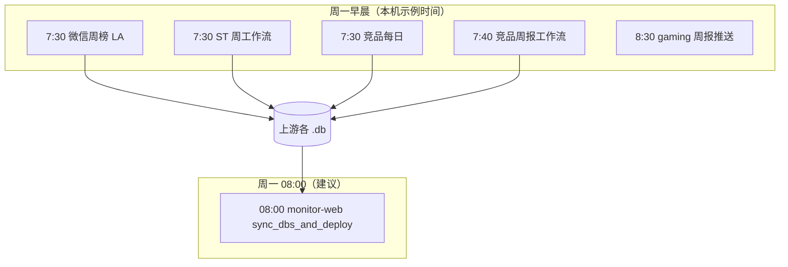

# 定时任务说明

本文档说明与本项目（monitor-web）相关的 **crontab / LaunchAgent**、任务依赖与流程。  
**实际以本机 `crontab -l` 与 LaunchAgents 为准**；下列「本机当前」一节根据最近一次核对整理，换机器或改时间后请同步更新本文档。

**原则与约定**（只针对 monitor-web + 三库依赖链）：见 **[监测链定时任务规范.md](./监测链定时任务规范.md)**。

---

## 〇、与本项目相关的任务清单（应对照用）

| 类别 | 期望内容 | 本机实现要点 |
|------|----------|----------------|
| 竞品每日爬取 | 每天更新竞品社媒库 | `Olivr-competitor-monitor/run-daily-scraper.sh`（cron **每天 7:30**） |
| 竞品每周周报生成 | 周一生成周期周报并写库、可选推送 | `run-weekly-period-workflow.sh`（cron **每周一 7:40**） |
| 微信/抖音每周爬取 | 周一榜单入库 | **统一用 crontab**（**每周一 7:30**），见 **[scripts/monitoring-chain.cron.fragment.txt](../scripts/monitoring-chain.cron.fragment.txt)**；若仍保留旧 **LaunchAgent**，须卸载避免重复（见 **[监测链定时任务规范.md](./监测链定时任务规范.md)** 第九节） |
| SensorTower 每周一工作流 | 周榜/异动等 | `sensortower-/scripts/cron_run_weekly.sh` → `weekly_automated_workflow.js`（cron **每周一 7:30**） |
| SensorTower 每日任务（含 **我方产品** US 免费榜日环比） | 日更写库 + 可选推送 | **`sensortower-/scripts/cron_run_us_free_daily.sh`** → `us_free_appid_weekly_rank_changes.js --daily`（本机 crontab 为 **每天 8:30**；与 README「我方产品检测」一致） |
| 其它产品侧任务（示例） | 独立项目 | 如 **trustmrr-feishu-push**（0:00 daily 等），与 ST 我方产品无关 |
| 游戏侧日报/周报（gaming-daily-report） | 每日爬取 + 周一推送 | `run_gaming_daily.sh`（**每天 8:00**）；`send_gaming_weekly.py`（**每周一 8:30**） |
| **本仓库：同步三库 + 部署 + 推送** | 拷库 → `npm run deploy` → **三条**周报推送（与 `run_all_latest_reports.sh` 一致：ST / 竞品社媒 / 微信抖音） | **`monitor-web/scripts/sync_dbs_and_deploy.sh`**（建议 **每周一 08:00**，见下） |

**重要**：请在本机 **crontab** 增加 `sync_dbs_and_deploy.sh`（见「五」）。脚本默认 **`SYNC_CUTOFF_HOUR=7`**（今日 7:00 之后有修改即视为就绪），以便 **8:00** 跑时 7:30 上游已写完。「我方产品」日更若在 **8:30**，则 **周一 8:00** 的同步**尚未**包含当日这次；若需包含，请把同步改到 **8:35 之后**（或 **9:00**），或另设 `SYNC_CUTOFF_HOUR` 与同步时刻。

---

## 一、任务总览（monitor-web 与数据上游）

### 1.1 本机当前 crontab 中与监测链相关的条目（摘要）

| 执行时间 | 频率 | 任务说明 | 脚本/命令 |
|----------|------|----------|-----------|
| **7:30** | 每天 | 竞品每日爬取 | `Olivr-competitor-monitor/run-daily-scraper.sh` |
| **7:30** | 每周一 | SensorTower 周工作流 | `sensortower-/scripts/cron_run_weekly.sh`（内部调用 `weekly_automated_workflow.js`） |
| **7:40** | 每周一 | 竞品周报生成（时间段工作流） | `Olivr-competitor-monitor/run-weekly-period-workflow.sh` |
| **8:00** | 每天 | 游戏日报管线（gaming-daily-report） | `gaming-daily-report 2/run_gaming_daily.sh` |
| **8:30** | 每周一 | 游戏周报推送（gaming-daily-report） | `send_gaming_weekly.py` |
| **8:30** | 每天 | SensorTower **我方产品**日更（US 免费榜日环比） | `sensortower-/scripts/cron_run_us_free_daily.sh`（内部：`us_free_appid_weekly_rank_changes.js --daily`） |
| **0:00** | 每天 | trustmrr 日任务 | `trustmrr-feishu-push/run_trustmrr_cron.sh daily` |
| **9:00 / 9:30** | 每周一 | trustmrr 周生成 / 周推送 | `run_trustmrr_cron.sh weekly-*` |

### 1.2 LaunchAgent（监测链已迁 cron 时此处应为空）

监测链要求微信周榜**改由 crontab**（见 `scripts/monitoring-chain.cron.fragment.txt`）。若本机仍存在下列 plist，仅为**迁移前残留**，请按 **[监测链定时任务规范.md](./监测链定时任务规范.md) 第九节** 卸载。

| 历史项（待卸载） | 说明 |
|------------------|------|
| `com.wechat.minigame.weekly_scrape.plist` | 原每周一 7:30 微信周榜，与 cron **二选一** |

### 1.3 本仓库 monitor-web

| 执行时间 | 频率 | 任务说明 | 脚本 | 输出/日志 |
|----------|------|----------|------|-----------|
| **08:00**（需自行加入 crontab） | 每周一 | 备份 → 同步三库 → 部署 → **三条**推送（ST / 竞品社媒 / 微信抖音） | `monitor-web/scripts/sync_dbs_and_deploy.sh` | `monitor-web/logs/sync_dbs_cron.log`（若配置）、`monitor-web/logs/sync_dbs_and_deploy_YYYY-MM-DD.log` |
| **10:30**（若已配置） | 每天 | AI 日报 + 热点日报推送 | `monitor-web/scripts/run_reports.sh --content hot,ai` | `monitor-web/logs/daily_reports.log` |

### 同步+部署任务输出

- **Crontab 追加**：`monitor-web/logs/sync_dbs_cron.log`（绝对路径示例：`/Users/ggbond/lyb/monitor-web/logs/sync_dbs_cron.log`）
- **脚本内部按日日志**：`monitor-web/logs/sync_dbs_and_deploy_YYYY-MM-DD.log`

### 各任务更新的数据/产物（路径以 `~/lyb` 为准）

| 任务 | 更新的数据或产物 |
|------|------------------|
| 微信/抖音周榜（周一 7:30 LaunchAgent） | `wechat-mini-game-ranking-post/data/wechatdouyin.db`（入库后常同步为 monitor-web 的 `public/wechatdouyin.db`） |
| 竞品每日（7:30） | `Olivr-competitor-monitor/db/competitor_data.db` |
| SensorTower 周任务（周一 7:30） | `sensortower-/data/sensortower_top100.db` |
| SensorTower「我方产品」日更（**8:30**，见本机 crontab） | `sensortower_top100.db` / 相关表；**周一 8:00 同步早于 8:30 日更**则该趟不含当日我方产品日更写入 |
| 竞品周报（周一 7:40） | 写回 `competitor_data.db` 等，并可能推送；脚本末尾可 `cp` 至 `monitor-web/public/competitor_data.db` |
| 同步+部署（周一 **08:00**，若配置） | 从三处上游拷库到 `monitor-web/public/` → `npm run deploy` → `send_sensortower_weekly_push` / `send_competitor_social_weekly_push` / `send_wechat_douyin_weekly_push` |

---

## 二、任务依赖与联系

1. **monitor-web 的 `sync_dbs_and_deploy.sh`** 依赖三份上游库在当日 cutoff（**默认今日 7:00 之后**有修改，可用 `SYNC_CUTOFF_HOUR` 覆盖）已更新；脚本内会轮询最多约 90 分钟。周一 **7:30～7:40** 的上游一般可满足 **8:00** 同步。「我方产品」日更在 **8:30** 时，**8:00** 同步**不会**包含该次写入；若需包含，请把同步改到 **8:35 之后**（或调 cutoff / 日更时刻）。

2. **同步+部署后的三条推送** 与 **`scripts/run_all_latest_reports.sh`** 一致：依次 `send_sensortower_weekly_push.py`、`send_competitor_social_weekly_push.py`、`send_wechat_douyin_weekly_push.py`（均在 **deploy 成功后**执行）。**单独手动发「合并版」**仍可用 `send_minigame_weekly_reports.py --content game`（与 `run_reports.sh` 等）；与 **gaming-daily-report** 的 `send_gaming_weekly.py`（8:30）是**不同项目**，勿混淆。推送文末会提示监测站 **`用户名：admin` / `密码：guru666`**（若生产已改账号口令，需同步改脚本文案），详见 **[自动任务与推送.md](./自动任务与推送.md)** 第七节。

3. **竞品社媒** 与 `send_competitor_digest.py`（已转发到 `send_competitor_social_weekly_push`）为同一路；若 crontab 仍保留 **周一 7:40** 的 `run-weekly-period-workflow.sh`（内含推送），可能与 monitor-web 侧竞品推送**重复**，需按业务择一保留。

4. **每日任务**（竞品 7:30、ST 我方产品 8:30、游戏日报 8:00 等）与 **周一集中任务** 相互独立；monitor-web 周一只依赖「拷库 + deploy + 推送」链路是否配置完整。

---

## 三、完整流程图（周一与 monitor-web）



---

## 四、日志与排查

| 想看的内容 | 查看的日志/输出 |
|------------|------------------|
| 同步+部署是否执行 | `monitor-web/logs/sync_dbs_and_deploy_YYYY-MM-DD.log`、`sync_dbs_cron.log`（若配置了 crontab 重定向） |
| 竞品每日 / 周报 | `Olivr-competitor-monitor/logs/cron-daily-scraper.log`、`logs/cron.log` |
| SensorTower 周任务 | `sensortower-/logs/weekly_workflow.log`（`cron_run_weekly.sh` 追加写入） |
| SensorTower 我方产品日更（`cron_run_us_free_daily.sh`） | `sensortower-/logs/us_free_daily.log` |
| 微信/抖音周榜 | `wechat-mini-game-ranking-post/logs/weekly_scrape_import.log` |
| gaming-daily-report | `/tmp/gaming_daily.log`、`/tmp/gaming_weekly.log`（以你 crontab 为准） |
| AI/热点日报（若配置） | `monitor-web/logs/daily_reports.log` |

---

## 五、Crontab 配置速查

以下为 **建议补充的本仓库条目**（若尚未添加）：

```cron
# 每周一 08:00：备份 → 拷三库 → 部署 GitHub Pages → 三条周报推送（ST / 竞品社媒 / 微信抖音）
0 8 * * 1 /bin/bash -c 'cd /Users/ggbond/lyb/monitor-web && ./scripts/sync_dbs_and_deploy.sh >> logs/sync_dbs_cron.log 2>&1'

# 可选：每天 10:30 热点 + AI 日报推送
# 30 10 * * * /bin/bash /Users/ggbond/lyb/monitor-web/scripts/run_reports.sh --content hot,ai >> /Users/ggbond/lyb/monitor-web/logs/daily_reports.log 2>&1
```

修改定时任务：`crontab -e`。  
微信周榜在 **LaunchAgent** 中配置，不在 `crontab` 里。

---

## 六、与旧版文档的差异说明

- 早期文档写「10:00 微信 / 10:15 竞品 / 10:30 ST 与竞品周报」，与**当前本机**「7:30 / 7:40 / LaunchAgent」不一致处，以本文件 **〇、一** 节为准。
- 上游库文件名以实际为准：`wechatdouyin.db` 等；`sync_dbs_and_deploy.sh` 内路径见脚本头部变量。
