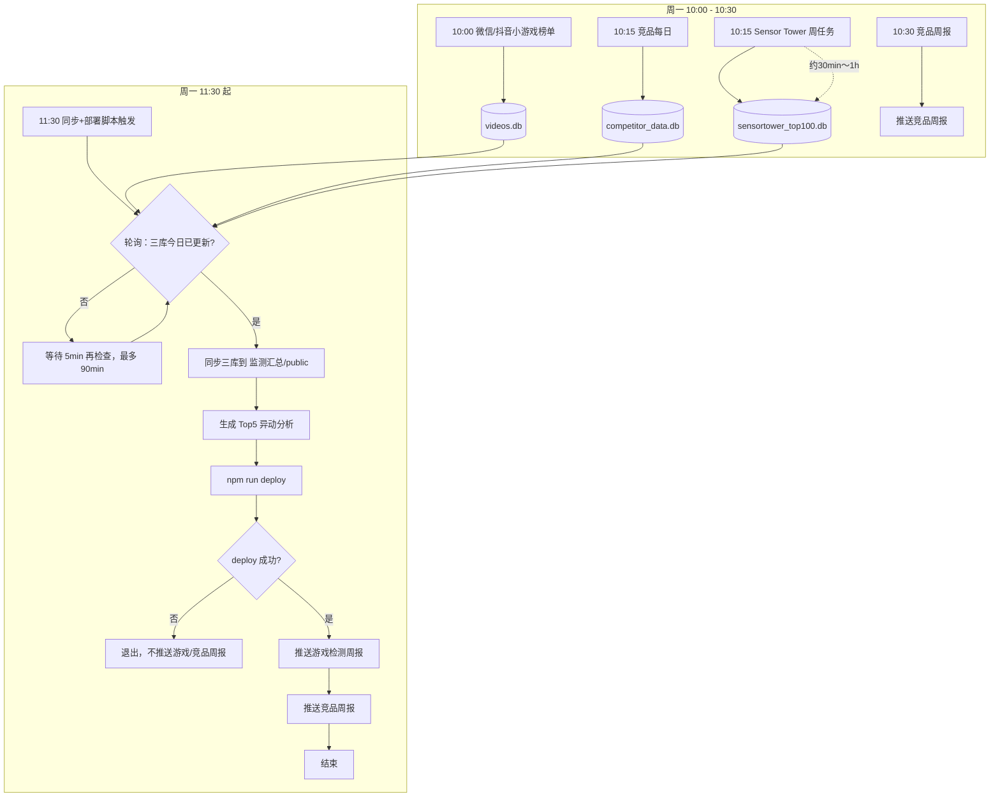
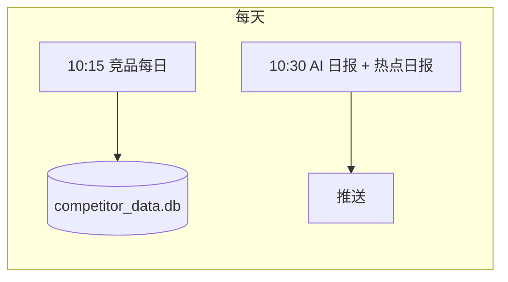
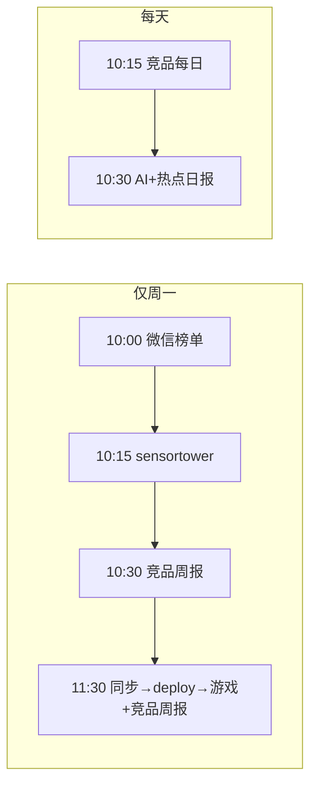

# 定时任务说明

本文档说明当前所有 crontab 定时任务、其输出位置以及任务之间的依赖与流程。

---

## 一、任务总览

| 执行时间 | 频率 | 任务说明 | 脚本/命令 | 输出/日志 |
|----------|------|----------|-----------|-----------|
| **10:30** | 每周一 | 获取上周微信、抖音小游戏榜单并入库 | `wechat-mini-game-ranking-post/scripts/weekly_scrape_and_import.sh` | `wechat-mini-game-ranking-post/logs/weekly_scrape_import.log` |
| **10:15** | 每天 | 获取最新竞品信息 | `-/run-daily-scraper.sh` | `-/logs/cron.log` |
| **10:30** | 每周一 | 获取 Sensor Tower 上周数据（约 30min～1h） | `sensortower/scripts/weekly_automated_workflow.js` | `sensortower/logs/weekly_workflow.log` |
| **10:30** | 每周一 | 推送竞品周报 | `-/run-weekly-period-workflow.sh` | `-/logs/cron.log` |
| **11:30** | 每周一 | 同步三库 → 生成 Top5 异动分析 → 部署网站 → 推送游戏检测周报、竞品周报 | `监测汇总/scripts/sync_dbs_and_deploy.sh` | 见下方「同步+部署任务输出」 |

### 同步+部署任务（11:30）的输出

- **Crontab 追加**：`监测汇总/logs/sync_dbs_cron.log`
- **脚本内部按日日志**：`监测汇总/logs/sync_dbs_and_deploy_YYYY-MM-DD.log`

### 各任务更新的数据/产物

| 任务 | 更新的数据或产物 |
|------|------------------|
| 微信/抖音小游戏榜单（周一 10:00） | `wechat-mini-game-ranking-post/data/videos.db` |
| 竞品每日（每天 10:15） | `-/db/competitor_data.db`（或 `database/db/competitor_data.db`） |
| Sensor Tower 周任务（周一 10:15） | `sensortower/data/sensortower_top100.db` |
| 竞品周报（周一 10:30） | 使用竞品 DB 生成并推送周报，不改变 DB 路径 |
| 同步+部署（周一 11:30） | 将三处 DB 复制到 `监测汇总/public/`；用 `generate_top5_insight.py` 生成最新一周异动分析（写入 `public/休闲游戏检测/sensortower_周报/`）；然后 `npm run deploy`，成功后再推送游戏检测周报与竞品周报 |

---

## 二、任务依赖与联系

1. **游戏检测周报** 依赖：
   - Sensor Tower 数据（`sensortower_top100.db` 已更新）
   - 网站已成功部署（用户通过线上页面查看）
   - 因此游戏周报**不再**在 10:30 单独跑，而是由 **11:30 的同步+部署脚本**在 `npm run deploy` 成功后再执行。

2. **竞品周报** 现由 **11:30 的同步+部署脚本**在 deploy 成功、游戏周报推送完成后再次执行（使用已同步的竞品 DB 与已部署网站）。crontab 中若仍保留周一 10:30 的竞品周报条目，则周一会执行两次竞品周报；若希望仅在 deploy 后发送一次，可从 crontab 中移除 10:30 的 `run-weekly-period-workflow.sh`。

3. **同步+部署脚本** 依赖：
   - 三个源库在「今日 10:00 之后」被更新（脚本内每 5 分钟检查一次，最多等 90 分钟）：
     - `sensortower/data/sensortower_top100.db`
     - `-/db/competitor_data.db`（或 `database/db/competitor_data.db`）
     - `wechat-mini-game-ranking-post/data/videos.db`
   - 对应由周一 10:00 微信榜单、10:15 sensortower、10:15 竞品每日（以及周一的竞品周报前数据）更新，因此 11:30 触发后会在源就绪后再执行同步与部署。

4. **每日任务** 与 **周一任务** 的关系：
   - 每天 10:15 竞品、10:30 AI+热点 独立运行，不依赖周一流程。
   - 周一在 10:00～10:30 之间会多出：微信榜单、sensortower 周任务、竞品周报；11:30 的同步+部署+游戏周报只依赖「三个源库今日已更新」与「deploy 成功」。

---

## 三、完整流程图

### 3.1 每周一流程（含依赖与产出）



### 3.2 每日流程（与周一无关的任务）



### 3.3 总览：按时间线（周一 vs 每日）



---

## 四、日志与排查

| 想看的内容 | 查看的日志/输出 |
|------------|------------------|
| 同步+部署是否执行、等待多久、是否成功 | `监测汇总/logs/sync_dbs_and_deploy_YYYY-MM-DD.log`、`sync_dbs_cron.log` |
| 游戏周报、竞品周报是否被推送 | 同上，脚本在 deploy 成功后会写「开始推送游戏检测周报」「开始推送竞品周报」 |
| Sensor Tower 周任务 | `sensortower/logs/weekly_workflow.log` |
| 竞品每日 + 竞品周报 | `-/logs/cron.log` |
| 微信/抖音榜单爬取与入库 | `wechat-mini-game-ranking-post/logs/weekly_scrape_import.log` |
| AI/热点日报推送 | `监测汇总/logs/daily_reports.log` |

---

## 五、Crontab 配置速查

当前与监测汇总相关的 crontab 条目如下（仅作说明，实际以 `crontab -l` 为准）：

```cron
# 每天 10:30 推送最新 AI 日报 + 热点日报
30 10 * * * /bin/bash /Users/oliver/guru/监测汇总/scripts/run_reports.sh --content hot,ai >> /Users/oliver/guru/监测汇总/logs/daily_reports.log 2>&1

# 每周一 10:00 微信/抖音小游戏榜单
0 10 * * 1 /Users/oliver/guru/wechat-mini-game-ranking-post/scripts/weekly_scrape_and_import.sh >> .../weekly_scrape_import.log 2>&1

# 每天 10:15 竞品每日
15 10 * * * /Users/oliver/guru/-/run-daily-scraper.sh >> /Users/oliver/guru/-/logs/cron.log 2>&1

# 每周一 10:15 sensortower
15 10 * * 1 cd /Users/oliver/guru/sensortower && /opt/homebrew/bin/node .../weekly_automated_workflow.js >> logs/weekly_workflow.log 2>&1

# 每周一 10:30 竞品周报
30 10 * * 1 /Users/oliver/guru/-/run-weekly-period-workflow.sh >> /Users/oliver/guru/-/logs/cron.log 2>&1

# 每周一 11:30 同步+部署+游戏周报+竞品周报
30 11 * * 1 /bin/bash /Users/oliver/guru/监测汇总/scripts/sync_dbs_and_deploy.sh >> /Users/oliver/guru/监测汇总/logs/sync_dbs_cron.log 2>&1
```

修改定时任务请使用：`crontab -e`。
