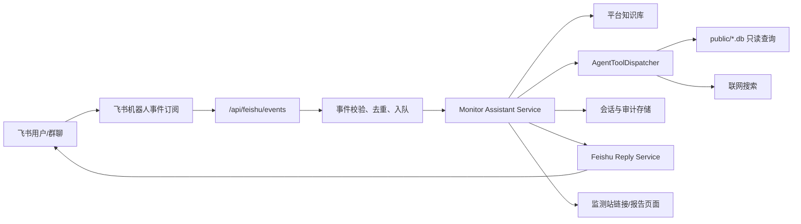

# 飞书监测助手需求文档

## 1. 背景

当前监测助手已经作为网站右下角 AI 对话浮层存在，用户需要先打开监测汇总网站，再结合当前页面上下文提问。后端已经具备以下基础能力：

- `/api/ai/chat` 与 `/api/ai/chat/stream`：承接自然语言问题，调用大模型返回回答。
- `AI_PROVIDER=openrouter/codex/openai`：支持纯对话或带工具调用的 agent 模式。
- `AgentToolDispatcher`：可在服务端只读查询 `public/` 下 SQLite 数据、做联网搜索、生成图表 payload。
- `backend/knowledge/`：提供站点说明、数据源说明、助手行为规范等知识库。
- 飞书相关基础：已有 `FEISHU_WEBHOOK_URL` 推送、`FEISHU_APP_ID/FEISHU_APP_SECRET`、飞书媒体代理等配置和脚本。

终极目标是把“监测助手”从网站内浮层升级为“飞书内对话助手”：用户不需要打开网站，只要在飞书里向机器人提问，就能获取站内监测数据、报告摘要、榜单变化、趋势解读和必要链接。

## 2. 目标

### 2.1 用户目标

- 用户可以在飞书单聊、群聊或指定话题中直接询问监测问题。
- 用户可以用自然语言追问，不需要知道网站路由、数据库、SQL 或内部文件名。
- 用户能得到可执行的业务回答：结论、关键数据、趋势解释、原文/详情页链接。
- 对于复杂数据问题，机器人能主动查询站内数据，而不是只回答泛泛说明。

### 2.2 业务目标

- 降低监测信息获取门槛，让监测站从“人主动访问”变成“信息随问随到”。
- 复用现有网站数据、AI agent 和定时推送能力，避免重复建设一套数据系统。
- 后续支持主动订阅、日报/周报推送、异常提醒、关键词监控等飞书工作流。

### 2.3 技术目标

- 将现有网站 AI 能力抽象成可复用的 `Monitor Assistant Service`，同时服务网页和飞书。
- 飞书入口通过自建应用机器人事件订阅接入，而不是仅依赖 incoming webhook。
- 建立身份、权限、会话、审计和限流机制，确保“服务端可查数据”和“用户不可直连数据”的边界清晰。

## 3. 范围

### 3.1 本期范围

- 飞书机器人接收用户消息并回复文本答案。
- 支持单聊和群聊中 `@机器人` 后提问。
- 复用现有监测助手的知识库、站内数据查询、联网搜索和回答规范。
- 支持多轮会话，按飞书用户或会话维度保留短期上下文。
- 回答中可附监测站详情页链接，用户需要进一步查看时再跳转网站。
- 记录基础日志：用户、会话、问题、回答状态、耗时、错误原因。

### 3.2 后续范围

- 飞书消息卡片：表格、Top N、按钮跳转、订阅入口。
- 图片/图表渲染：把现有 chart payload 渲染成图片或卡片图表发回飞书。
- 主动订阅：用户订阅某类日报、周报、榜单异动、竞品更新。
- 群内协作：问题引用、报告一键转发、群内沉淀 FAQ。
- 管理后台：配置可用群、白名单、默认订阅、用量和失败监控。

### 3.3 不做

- 不开放用户直接执行 SQL、下载数据库文件或访问原始 `.db`。
- 不把飞书机器人做成网站前端的替代管理后台。
- 不在飞书里完整复刻所有网站交互，如复杂筛选表格、长报告全文阅读。
- 不把普通 incoming webhook 当作对话入口；webhook 只能继续用于主动推送。

## 4. 用户与场景

### 4.1 典型用户

- 运营同学：想快速知道近期热点、榜单变化、竞品动作。
- 产品同学：想追问某个游戏、AI 产品或素材趋势。
- 负责人/管理者：想在群里快速获得摘要和判断，不想打开多个页面。
- 监测维护者：想验证某条数据是否已同步、某类报告是否已生成。

### 4.2 核心场景

| 场景 | 示例问题 | 期望结果 |
|---|---|---|
| 快速问数 | “这周 SensorTower Top 10 有哪些新上榜？” | 返回榜单变化、关键排名、详情页链接 |
| 趋势解读 | “最近微信小游戏榜有哪些连续上升的产品？” | 查询数据后总结趋势，必要时列 Top N |
| 报告摘要 | “帮我总结最新休闲游戏周报” | 返回摘要、重点机会、原文链接 |
| 竞品追踪 | “最近竞品有没有玩法更新或线下活动？” | 返回相关竞品、评分/影响、报告来源 |
| AI 产品监测 | “最近 AI 产品 UA 素材有什么变化？” | 返回素材榜单、创意类型、可关注产品 |
| 站内导航 | “这个数据在网站哪里看？” | 告诉用户页面入口，不暴露内部数据库 |
| 群内追问 | “刚才那个游戏再展开说说” | 能基于短期上下文理解“那个游戏” |

## 5. 功能需求

### 5.1 飞书消息接入

- 系统应创建飞书自建应用，并开启机器人能力。
- 系统应配置事件订阅，接收以下事件：
  - 单聊用户发给机器人的消息。
  - 群聊中 `@机器人` 的消息。
  - 可选：用户点击消息卡片按钮后的交互事件。
- 后端应提供飞书事件回调接口，例如 `POST /api/feishu/events`。
- 回调接口应完成飞书 challenge 校验、签名校验、事件去重和消息解析。

### 5.2 对话处理

- 用户消息进入后，应调用统一的监测助手服务，而不是复制一套飞书专用 prompt。
- 对话服务应支持：
  - 用户问题文本。
  - 会话历史。
  - 来源渠道：`web` / `feishu_dm` / `feishu_group`。
  - 用户身份：飞书 `open_id` / `union_id` / 映射后的站内用户。
  - 可选上下文：群名、消息线程、被回复消息。
- 对话服务应复用现有能力：
  - 平台知识库。
  - 数据库只读查询工具。
  - 联网搜索工具。
  - 回答规范和数据访问边界。

### 5.3 飞书回复

- MVP 支持纯文本或 Markdown 风格文本回复。
- 回复必须适合飞书阅读：
  - 先给结论，再给依据。
  - 数据列表控制长度，默认 5 到 10 条。
  - 长报告默认摘要，不直接刷屏。
  - 需要更多信息时给站内链接或提示用户继续追问。
- 对耗时问题应先给“正在查询”的即时反馈，最终再更新或追加答案。
- 当模型调用失败、数据缺失、权限不足时，应给明确错误说明和下一步建议。

### 5.4 多轮上下文

- 系统应按会话维度保存短期上下文：
  - 单聊：`feishu_open_id`。
  - 群聊：`chat_id + thread/root_message_id`，没有 thread 时可退化为 `chat_id + 最近 N 分钟窗口`。
- 默认保留最近 10 轮或最近 24 小时上下文。
- 用户可以通过“重新开始”“清空上下文”等指令重置会话。

### 5.5 权限与身份

- MVP 可先使用飞书用户白名单或群白名单控制访问。
- 后续应支持飞书用户与站内用户映射。
- 不同用户可配置不同权限：
  - 普通用户：查看已发布监测内容、报告摘要、榜单结果。
  - 内部用户：可问更细的数据核对问题。
  - 管理员：可查看同步状态、失败日志、配置订阅。
- 任何权限级别都不应让用户直接拿到数据库路径、SQL 操作方法或原始密钥。

### 5.6 主动订阅与推送

MVP 可先不做，但架构需预留：

- 用户可订阅：
  - AI 热点日报。
  - 热点趋势日报。
  - 休闲游戏周报。
  - SensorTower 榜单异动。
  - 竞品社媒/UA 更新。
  - 我方产品榜单变化。
- 订阅可按用户、群、主题配置。
- 已有 `scripts/send_*.py` 推送脚本应逐步收敛为统一推送服务，避免每条推送各写一套飞书逻辑。

## 6. 非功能需求

### 6.1 可用性

- 常规问题 10 秒内回复；复杂查询 30 秒内给出最终结果或阶段性说明。
- 飞书回调必须快速返回，耗时处理应异步执行。
- 同一事件需要幂等处理，避免飞书重试导致重复回复。

### 6.2 安全

- 校验飞书事件签名与 challenge。
- 敏感配置只通过环境变量注入，不写入前端或文档示例。
- 数据查询工具保持只读，继续禁止写 SQL、危险关键字、路径越界。
- 日志中不记录完整 token、密钥、用户敏感输入。

### 6.3 稳定性

- 对大模型调用、飞书 API 调用、数据库查询分别设置超时和错误兜底。
- 失败要可观测：记录请求 ID、飞书 event ID、耗时、异常类型。
- 支持灰度：先限定测试群，再扩大到业务群。

### 6.4 成本控制

- 限制单用户/单群每分钟请求数。
- 长上下文自动摘要或截断。
- 常见报告摘要可缓存，避免重复调用模型。
- 对简单导航类问题优先用规则/知识库回答。

## 7. 技术实现路径

### 7.1 推荐架构



### 7.2 代码改造建议

第一步：抽象对话服务。

- 将 `backend/main.py` 中 `_build_system_content`、`_build_openai_messages_for_request`、`_chat_via_openrouter`、`_chat_via_openai`、`_chat_via_codex` 相关逻辑迁到独立模块，例如 `backend/assistant_service.py`。
- 对外提供统一方法：

```python
async def run_monitor_assistant(
    message: str,
    history: list[dict] | None = None,
    context: dict | None = None,
    channel: str = "web",
    user: dict | None = None,
) -> AssistantResult:
    ...
```

第二步：新增飞书事件模块。

- 新增 `backend/feishu_bot.py`：
  - tenant token 获取与缓存。
  - 事件签名/challenge 校验。
  - 消息解析。
  - 文本/卡片回复。
  - event_id 去重。
- 在 `backend/main.py` 注册 `POST /api/feishu/events`。

第三步：新增会话存储。

- MVP 可用 `data/feishu_sessions.jsonl` 或 SQLite。
- 建议后续统一为 `data/assistant_sessions.db`：
  - `sessions`：会话 ID、渠道、飞书 open_id/chat_id、更新时间。
  - `messages`：role、content、created_at、token/字符长度。
  - `events`：飞书 event_id、处理状态、错误信息。

第四步：异步处理。

- 回调收到飞书事件后，先校验和去重。
- 对简单 challenge 立即返回。
- 对用户消息快速入队，后台执行 assistant。
- 若部署环境暂不引入队列，可先用 `asyncio.create_task`，生产建议使用 Redis/RQ、Celery 或独立 worker。

第五步：飞书卡片与图表。

- 现有 `dispatcher.chart_payloads` 可以先降级为文本摘要。
- 后续有两条路线：
  - 服务端把 chart payload 渲染成图片，上传飞书图片并发送。
  - 转成飞书消息卡片表格/字段列表，适合 Top N 和榜单结果。

## 8. 分阶段里程碑

### Phase 0：对齐与准备

- 明确飞书应用归属、可访问群、测试用户。
- 确认可用数据范围和权限边界。
- 确认生产环境回调公网地址与 HTTPS。
- 输出本需求文档并评审。

验收标准：

- 文档确认“飞书机器人是对话入口，网站仍是详情承载入口”。
- 安全边界确认：用户不接触数据库、SQL、密钥。

### Phase 1：MVP 对话机器人

- 新增飞书事件回调接口。
- 支持单聊和群聊 `@机器人`。
- 复用现有监测助手回答能力。
- 支持短期上下文。
- 使用白名单限制测试范围。
- 回复纯文本答案和站内链接。

验收标准：

- 在测试群里提问“最新休闲游戏周报总结一下”，机器人能返回摘要。
- 提问“SensorTower 最近 Top 10 有哪些变化”，机器人能查数并回答。
- 提问“我可以自己查数据库吗”，机器人明确拒绝并引导网站页面。
- 重复飞书事件不会重复回复。

### Phase 2：体验增强

- 支持“正在查询”中间态。
- 支持卡片回复：摘要、Top N、按钮跳转详情页。
- 支持图表结果渲染或表格化。
- 支持反馈按钮：有用/无用/需要人工跟进。
- 会话历史持久化并可清空。

验收标准：

- 群聊里复杂问题不会长时间无反馈。
- 榜单类结果以卡片或表格形式展示，阅读成本低。
- 用户反馈能进入 `ai_message_feedback` 或统一反馈表。

### Phase 3：主动订阅

- 支持用户/群订阅日报、周报、异动提醒。
- 与现有 `scripts/send_*.py` 推送逻辑整合。
- 支持飞书内查看、开启、关闭订阅。
- 管理员可配置默认推送群和时间。

验收标准：

- 用户能在飞书里说“订阅 AI 热点日报”，后续自动收到推送。
- 群管理员能关闭某类推送。
- 推送失败有日志和重试。

### Phase 4：运营化

- 建立监控面板：请求量、成功率、平均耗时、模型错误、飞书错误。
- 增加权限分层、组织架构同步、用户映射。
- 建立高频问题缓存和报告摘要缓存。
- 支持更多交互：选择日期、选择榜单、选择产品后继续追问。

## 9. 环境变量建议

| 变量 | 说明 |
|---|---|
| `FEISHU_APP_ID` | 飞书自建应用 App ID |
| `FEISHU_APP_SECRET` | 飞书自建应用 App Secret |
| `FEISHU_VERIFICATION_TOKEN` | 事件订阅 verification token |
| `FEISHU_ENCRYPT_KEY` | 事件加密 key，启用加密时使用 |
| `FEISHU_BOT_ENABLED` | 是否启用飞书机器人入口 |
| `FEISHU_ALLOWED_OPEN_IDS` | 测试期用户白名单 |
| `FEISHU_ALLOWED_CHAT_IDS` | 测试期群白名单 |
| `ASSISTANT_SESSION_STORE` | 会话存储类型，如 `jsonl` / `sqlite` |
| `ASSISTANT_MAX_HISTORY_TURNS` | 单次请求带入历史轮数 |
| `ASSISTANT_RATE_LIMIT_PER_MINUTE` | 用户或群限流 |

## 10. 数据与权限边界

- 飞书用户看到的是助手回答，不是数据库查询能力。
- 服务端可以为了回答问题调用只读工具，但不应把数据库名、表名、SQL 当作普通用户操作指引。
- 回答应优先使用业务语言，例如“SensorTower 榜单”“微信/抖音小游戏榜”“竞品周报”。
- 当问题涉及未发布、未同步或权限不足的数据时，应明确说明“当前监测站未提供”或“你暂无权限查看”。
- 飞书群聊默认视为多人可见场景，机器人不应输出敏感配置、内部路径、密钥、账号密码。

## 11. 风险与应对

| 风险 | 影响 | 应对 |
|---|---|---|
| 飞书回调超时 | 消息处理失败或重试重复 | 回调快速确认，异步处理，event_id 去重 |
| 大模型回答幻觉 | 误导业务判断 | 强化知识库、工具优先、回答附依据、反馈闭环 |
| 权限边界不清 | 数据泄露风险 | 白名单、用户映射、敏感信息过滤、日志审计 |
| 群聊上下文混乱 | 追问理解错误 | 按 thread/root message 管理上下文，支持重置 |
| 图表在飞书展示困难 | 数据可读性下降 | MVP 文本摘要，Phase 2 再做卡片/图片 |
| 推送脚本分散 | 后续维护成本高 | 逐步收敛为统一 Feishu Reply/Push Service |

## 12. 待决策问题

1. 飞书机器人优先支持哪些入口：单聊、群聊 `@机器人`、还是固定业务群？
2. MVP 白名单按用户还是按群控制？
3. 是否需要把飞书用户与网站登录用户打通，还是先独立授权？
4. 复杂查询是否允许超过 30 秒，还是统一异步回复“稍后给你结果”？
5. 图表优先做飞书卡片表格，还是服务端渲染图片？
6. 主动订阅的第一批内容选哪些：日报、周报、榜单异动、竞品更新？
7. 飞书内是否需要管理员命令，例如“查看订阅”“关闭本群推送”“查看同步状态”？

## 13. 推荐结论

建议按“先接对话，再做卡片，再做订阅”的路径推进。

最短可行路径不是重写一个飞书助手，而是把现有网页 AI 后端抽象成统一助手服务，再新增飞书事件入口。这样 MVP 能最快复用已有数据、工具和回答规范；后续再把飞书特有体验补齐，包括消息卡片、图表、订阅和群管理。

