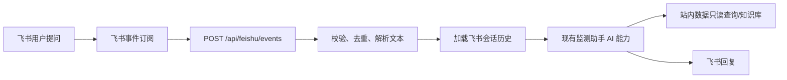

# 飞书监测助手项目规划

## 1. 交付目标

本项目第一阶段只解决一个核心问题：用户可以不打开监测网站，直接在飞书里向机器人提问，机器人复用现有监测助手能力返回答案。

MVP 的端到端链路：

## 2. 实施拆分

### 阶段 1：MVP 对话闭环

目标：飞书里能问，机器人能答。

已产出：

- 新增 `backend/feishu_bot.py`
  - 飞书 tenant token 获取与缓存。
  - 飞书 URL verification challenge 处理。
  - `im.message.receive_v1` 文本事件解析。
  - 事件去重。
  - SQLite 会话存储。
  - 飞书消息回复。
- 更新 `backend/config.py`
  - 增加飞书机器人开关、校验 token、白名单、历史轮数等配置。
- 更新 `backend/main.py`
  - 新增 `POST /api/feishu/events`。
  - 飞书事件异步处理，避免回调等待大模型。
  - 复用现有 `_chat_via_openai` / `_chat_via_openrouter` / `_chat_via_codex`。

验收方式：

- 飞书后台 URL 校验能通过。
- 用户在单聊或群聊 `@机器人` 提问后，后端返回 `{"ok": true}`。
- 机器人先回复“正在查询”，再回复监测助手答案。
- 重复 event_id 不会重复触发回答。

### 阶段 2：回答体验优化

目标：让飞书回答更像工作流，而不是网页聊天搬运。

计划项：

- 针对飞书渠道单独优化回答长度、标题、列表结构。
- 将工具返回的 chart payload 降级为飞书可读表格摘要。
- 为报告类回答增加“查看详情”链接。
- 增加“清空上下文”“重新开始”等会话指令。
- 增加用户反馈入口，接入已有 AI 回复赞/踩日志。

### 阶段 3：权限和运营

目标：从测试群可用变成团队内稳定使用。

计划项：

- 飞书 open_id / chat_id 白名单改为可维护配置。
- 增加后台日志查询：请求量、失败率、耗时、飞书 API 错误。
- 将会话存储从本地 SQLite 迁移到更稳定的持久化存储（如部署平台挂载盘或外部数据库）。
- 对高频报告摘要做缓存，降低模型成本。

### 阶段 4：主动订阅

目标：用户不仅能问，还能订阅和收到主动提醒。

计划项：

- 整合现有 `scripts/send_*.py` 的飞书推送逻辑。
- 支持飞书内命令：
  - “订阅 AI 热点日报”
  - “订阅休闲游戏周报”
  - “取消本群 SensorTower 推送”
  - “查看本群订阅”
- 支持榜单异动、竞品更新、我方产品排名变化提醒。

## 3. 当前配置

后端新增环境变量：

| 变量 | 必填 | 说明 |
|---|---:|---|
| `FEISHU_BOT_ENABLED` | 是 | 设为 `true` 后启用 `/api/feishu/events` |
| `FEISHU_APP_ID` | 是 | 飞书自建应用 App ID |
| `FEISHU_APP_SECRET` | 是 | 飞书自建应用 App Secret |
| `FEISHU_VERIFICATION_TOKEN` | 建议 | 飞书事件订阅 token |
| `FEISHU_ENCRYPT_KEY` | 可选 | 当前仅用于签名校验；MVP 建议先关闭事件加密 |
| `FEISHU_ALLOWED_OPEN_IDS` | 可选 | 逗号分隔；为空表示不按用户限制 |
| `FEISHU_ALLOWED_CHAT_IDS` | 可选 | 逗号分隔；为空表示不按群限制 |
| `FEISHU_ASSISTANT_SEND_THINKING` | 可选 | 默认 `true`，先回复“正在查询” |
| `ASSISTANT_MAX_HISTORY_TURNS` | 可选 | 默认 `10`，飞书会话带入的历史轮数 |

AI 侧沿用已有配置：

- `OPENAI_API_KEY`
- `OPENAI_BASE_URL`
- `OPENAI_MODEL`
- `AI_PROVIDER`
- `CODEX_ENABLE_DB_TOOL`
- `CODEX_ENABLE_WEB_SEARCH_TOOL`
- `TAVILY_API_KEY`

## 4. 飞书后台配置步骤

1. 新建一个独立的飞书自建应用（App ID 形如 `cli_...`），专门用于监测助手对话。
2. 确认该应用已开启机器人能力。
3. 在事件订阅里配置请求地址：

   `https://你的后端域名/api/feishu/events`

4. 订阅事件：

   `im.message.receive_v1`

5. MVP 阶段建议先关闭事件加密；保留 verification token 校验。
6. 发布应用到测试范围，将机器人拉入测试群。
7. 设置后端环境变量并重启服务。`backend/.env` 中要填写新应用自己的 `FEISHU_APP_ID` / `FEISHU_APP_SECRET`，不要复用根目录 `.env` 里已有的推送应用配置。

## 5. 验收问题集

建议上线测试时直接在飞书里问：

- “最新休闲游戏周报总结一下”
- “这周 SensorTower Top 10 有哪些变化？”
- “最近 AI 产品 UA 素材有什么值得关注？”
- “最近竞品有没有玩法更新或线下活动？”
- “我可以自己查数据库吗？”
- “刚才那个游戏再展开讲讲”

## 6. 已知限制

- 当前只处理文本消息，图片、文件、语音暂不处理。
- 当前飞书回复为纯文本，卡片和图表留到下一阶段。
- 当前事件加密解密未实现；如果飞书后台启用加密，接口会明确报错。
- 当前会话按单聊用户或群 ID 存储，群内多个话题的上下文隔离还比较粗。
